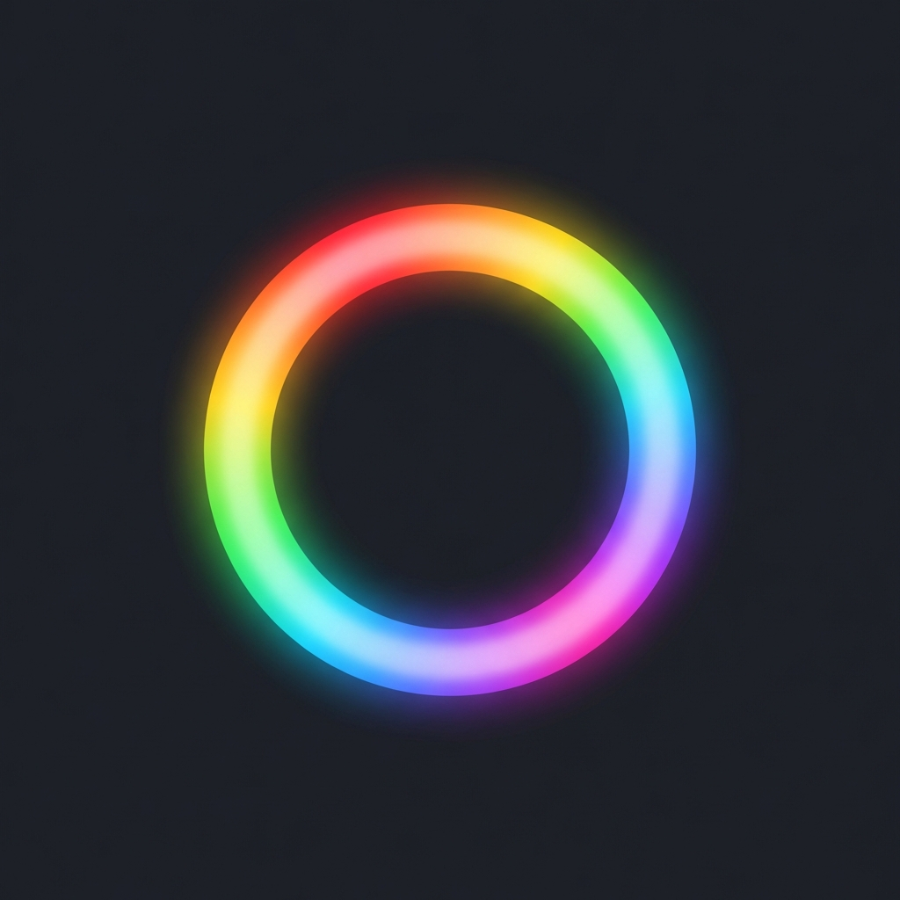
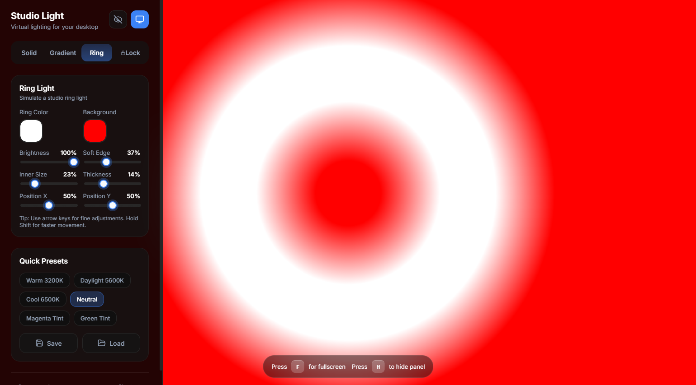

# Studio Light

<div align="center">
  
  <br />
  <p align="center">
    <strong>Professional virtual lighting for your desktop.</strong>
    <br />
    Turn your screen into a customizable softbox, gradient light, or ring light.
  </p>

  [](https://nextjs.org/)
  [](https://www.typescriptlang.org/)
  [](https://react.dev/)
  [](LICENSE)
</div>

---

## Overview

Studio Light is a professional-grade web application designed to replace physical lighting equipment with your monitor. It provides precise control over color temperature, RGB values, and light shapes, making it an essential tool for video calls, streaming, and photography.

- **High Performance**: Built with Next.js for a fast and fluid user experience.
- **Precision Control**: Adjustable Kelvin temperatures (1000K-40000K) and custom RGB blending.
- **Workflow Focused**: Designed with professional keyboard shortcuts for real-time adjustments.

---

## Features

- **Solid Light Mode**: Direct control over color temperature and solid RGB fills.
- **Gradient Light Mode**: Smooth blending between two colors with adjustable angles and intensities.
- **Ring Light Mode**: Virtual ring light simulation with controls for size, thickness, and feathering.
- **Presets**: Instant access to industry-standard lighting: Warm (3200K), Daylight (5600K), and Cool (6500K).
- **Wake Lock API**: Built-in prevention of screen sleep while the application is active.

---

## Application Preview

<div align="center">
  
</div>

---

## Tech Stack

| Component | Technology |
| :--- | :--- |
| Framework | [Next.js](https://nextjs.org/) (App Router) |
| UI Library | [React](https://react.dev/) |
| Language | [TypeScript](https://www.typescriptlang.org/) |
| Styling | CSS Modules & Global CSS |
| Icons | [Lucide React](https://lucide.dev/) |

---

## Keyboard Shortcuts

| Key | Action |
| :--- | :--- |
| `F` | Toggle Fullscreen |
| `H` | Hide/Show Control Panel |
| `Space` | Lock/Unlock Controls |
| `1` | Switch to Solid Mode |
| `2` | Switch to Gradient Mode |
| `3` | Switch to Ring Mode |
| `W` | Warm Preset (3200K) |
| `D` | Daylight Preset (5600K) |
| `C` | Cool Preset (6500K) |
| `Arrows` | Move Ring Light |
| `Shift + Arrows` | Move Ring Light (Fast) |

---

## Getting Started

### Prerequisites

- Node.js 18+

### Installation

1. Clone the repository:
   ```bash
   git clone https://github.com/Ismaeliki11/StudioL.git
   cd StudioL
   ```

2. Install dependencies:
   ```bash
   npm install
   ```

3. Start development:
   ```bash
   npm run dev
   ```

4. Open `http://localhost:3000` in your browser.

---

## Deployment

Optimized for deployment on Vercel. Simply connect your GitHub repository and the build configuration will be detected automatically.

---

## License

Distributed under the MIT License. See `LICENSE` for more information.
